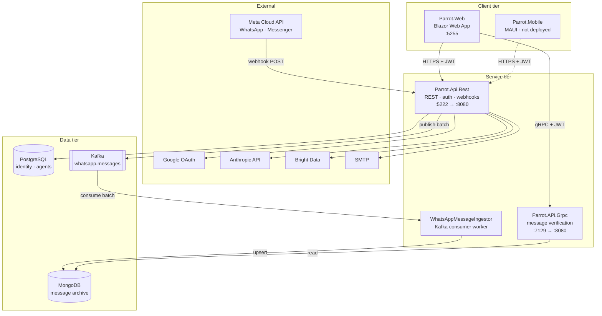
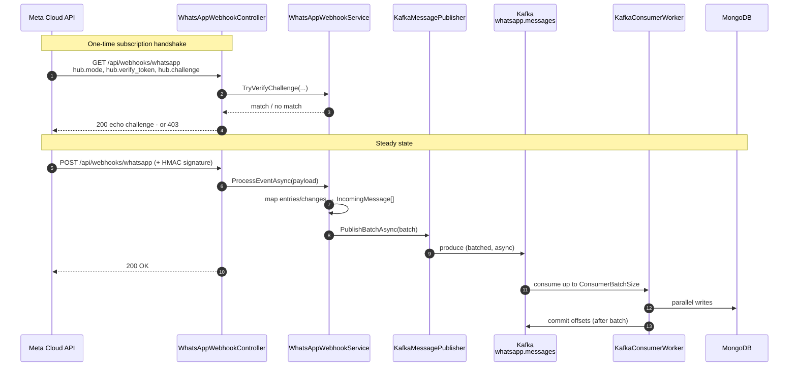

# Parrot

A multi-tenant SaaS platform for building conversational agents over business
messaging channels (WhatsApp and Facebook Messenger today), plus the low-code
agent-design layer described in [architecture.md](architecture.md).

This README covers the **system as it is built and deployed**: the services,
how they fit together, how to run them locally, and where to go for
deployment. For the product's target architecture — the intent/compiler/runtime
planes, validator rules, and spec model — read [architecture.md](architecture.md).

- **Deployment and infrastructure setup:** [docs/DEPLOYMENT.md](docs/DEPLOYMENT.md)
- **Product architecture and invariants:** [architecture.md](architecture.md)

---

## Architecture

### System overview



### Inbound message pipeline

The hot path. A customer messages a business on WhatsApp; the platform accepts
the delivery fast, then persists asynchronously so Meta never waits on a
database write.



Two properties of this design are load-bearing:

- **The webhook returns before persistence.** Meta retries aggressively on slow
  or failed deliveries; the only synchronous work is signature validation,
  mapping, and a Kafka produce.
- **Offsets commit after the batch is written**, not on consume
  (`EnableAutoCommit = false`). A crash mid-batch replays the batch rather than
  dropping it — writes must therefore stay idempotent on `MessageId`.

### Projects

| Project | Kind | Role |
|---|---|---|
| [Parrot.Api](Parrot.Api/) (`Parrot.Api.Rest`) | ASP.NET Core | REST API: identity, JWT, Google SSO, WhatsApp/Facebook webhooks, agents, business enrichment |
| [Parrot.APi.Grpc](Parrot.APi.Grpc/) | ASP.NET Core gRPC | Message verification service over the Mongo archive |
| [WhatsAppMessageIngestor](WhatsAppMessageIngestor/) | Worker service | Consumes `whatsapp.messages`, writes to MongoDB |
| [Parrot.Web](Parrot.Web/) | Blazor Web App | Customer dashboard (Server + WebAssembly interactive) |
| [Parrot.Mobile](Parrot.Mobile/) | .NET MAUI | Mobile client — builds only with the MAUI workloads installed |
| [Parrot.Application](Parrot.Application/) | Library | Use cases, DTOs, integration services, settings |
| [Parrot.Domain](Parrot.Domain/) | Library | Entities and enums |
| [Parrot.Infrastructure](Parrot.Infrastructure/) | Library | EF Core, Mongo repositories, Kafka publisher, email |
| [Parrot.Grpc.Contracts](Parrot.Grpc.Contracts/) | Library | `.proto` contracts shared by client and server |
| [Test.Parrot.Api](Test.Parrot.Api/) | Tests | Backend test suite |

### Solutions

Two solution files exist and they are **not** interchangeable:

- **`Backend.slnx`** — everything except `Parrot.Mobile`. This is what CI builds
  and what you should build locally.
- **`Parrot.Api.slnx`** — the above plus `Parrot.Mobile`. Requires the
  `maccatalyst`/`android` MAUI workloads (`dotnet workload restore`); without
  them the build fails with `NETSDK1147`.

Always pass the solution explicitly. A bare `dotnet build` in the repo root
fails with `MSB1011` because both files are present.

---

## Local development

### Prerequisites

- .NET SDK 10.0
- Docker (for Postgres, Kafka, MongoDB)
- `dotnet-ef` — `dotnet tool install --global dotnet-ef`

### 1. Start backing services

```bash
docker compose up -d
```

Brings up PostgreSQL (`5432`), Kafka (`9092`), MongoDB (`27017`). Override the
database password with `POSTGRES_PASSWORD`; it defaults to
`dev_password_change_me`, which matches `appsettings.Development.json`.

### 2. Create the Kafka topic

Auto-creation is enabled in the dev broker, but the ingestor subscribes at
startup and **terminates permanently if the topic does not yet exist** (see
[Known issues](#known-issues)). Create it up front:

```bash
docker exec parrot-kafka /opt/kafka/bin/kafka-topics.sh \
  --bootstrap-server localhost:9092 \
  --create --topic whatsapp.messages --partitions 1 --replication-factor 1
```

### 3. Apply database migrations

```bash
dotnet ef database update \
  --project Parrot.Infrastructure \
  --startup-project Parrot.Api
```

### 4. Build

```bash
dotnet build Backend.slnx
```

### 5. Run the services

Each in its own terminal:

```bash
dotnet run --project Parrot.Api/Parrot.Api.Rest.csproj      --launch-profile http    # http://localhost:5222
dotnet run --project Parrot.APi.Grpc/Parrot.APi.Grpc.csproj --launch-profile https   # https://localhost:7129
dotnet run --project Parrot.Web/Parrot.Web/Parrot.Web.csproj --launch-profile http   # http://localhost:5255
dotnet run --project WhatsAppMessageIngestor/WhatsAppMessageIngestor.csproj
```

| Service | URL |
|---|---|
| Web dashboard | http://localhost:5255 (redirects to `/login`) |
| REST API | http://localhost:5222 |
| OpenAPI document | http://localhost:5222/openapi/v1.json |
| gRPC | https://localhost:7129 (HTTP/2), http://localhost:5288 |

The Blazor app reads `ApiSettings:BaseUrl` and `GrpcSettings:BaseUrl` from
[appsettings.Development.json](Parrot.Web/Parrot.Web/appsettings.Development.json);
they point at `5222` and `7129` respectively, so start the API and gRPC service
before the dashboard.

### 6. Verify the stack end to end

Register a user:

```bash
curl -X POST http://localhost:5222/api/Auth/register \
  -H 'Content-Type: application/json' \
  -d '{"email":"you@example.com","password":"Str0ng!Pass","confirmPassword":"Str0ng!Pass","businessName":"Test Co"}'
```

Login is refused until the address is confirmed. In development there is no
SMTP server on `localhost:1025` by default, so either run one (MailHog,
Mailpit) or confirm the user directly:

```bash
docker exec parrot-postgres psql -U postgres -d parrot \
  -c "update \"AspNetUsers\" set \"EmailConfirmed\"=true where \"Email\"='you@example.com'"
```

Then log in and call an authorized route:

```bash
TOKEN=$(curl -s -X POST http://localhost:5222/api/Auth/login \
  -H 'Content-Type: application/json' \
  -d '{"email":"you@example.com","password":"Str0ng!Pass"}' | jq -r .data.token)

curl http://localhost:5222/api/Agent -H "Authorization: Bearer $TOKEN"
```

Exercise the ingest pipeline without Meta by producing a message directly:

```bash
echo '{"MessageId":"wamid.LOCAL-1","Platform":1,"ExternalAccountId":"acct","From":"254700000001","Timestamp":"1756800000","Type":"text","TextBody":"hello","ChannelId":"chan","ChannelDisplayName":"Parrot Dev","ContactName":"Tester","ReceivedAt":"2026-01-01T00:00:00Z"}' \
  | docker exec -i parrot-kafka /opt/kafka/bin/kafka-console-producer.sh \
      --bootstrap-server localhost:9092 --topic whatsapp.messages

docker exec parrot-mongodb mongosh --quiet parrot \
  --eval 'db.whatsapp_messages.find().sort({_id:-1}).limit(1).toArray()'
```

### Receiving real Meta webhooks locally

Meta only calls public HTTPS URLs. Expose the API with a tunnel
(`cloudflared`, `ngrok`), then set `WhatsApp:WebhookBaseUrl` to the public
origin and `WhatsApp:VerifyToken` to the token you enter in the Meta App
dashboard. `GET /api/webhooks/whatsapp` echoes `hub.challenge` on a token
match and returns `403` otherwise.

---

## Tests

```bash
dotnet test Backend.slnx
```

CI additionally enforces formatting:

```bash
dotnet format Backend.slnx --verify-no-changes
```

---

## Configuration

Configuration binds from `appsettings.json`, `appsettings.{Environment}.json`,
and environment variables. In containers, use the double-underscore form —
`Kafka:BootstrapServers` becomes `KAFKA__BOOTSTRAPSERVERS`.

| Section | Purpose |
|---|---|
| `ConnectionStrings:DefaultConnection` | PostgreSQL (identity, agents) |
| `JwtSettings` | Token signing — `Secret` must be ≥32 chars; a non-Development start with the placeholder throws at boot |
| `GoogleOAuth` | Google SSO; **required** — the API refuses to start without `ClientId`/`ClientSecret` |
| `Kafka` | Bootstrap servers, topic, consumer group, batch sizes, `UseGcpAuth` |
| `MongoDB` | Message archive connection, database, collection |
| `WhatsApp` / `Facebook` | Verify token, app secret, access token, phone number / business IDs |
| `EmailSettings` | SMTP for verification and password-reset mail |
| `Anthropic`, `BrightData` | Model access and business-profile enrichment |
| `FrontendSettings:BaseUrl` | Origin used when building links in outbound email |

Secrets never belong in `appsettings.json`. Locally use
`dotnet user-secrets`; in production they come from `/app/.env.prod` — see
[docs/DEPLOYMENT.md](docs/DEPLOYMENT.md).

---

## Deployment

The intended pipeline builds three images on a push to `main`, pushes them to
Google Artifact Registry, and redeploys them onto a GCE VM over SSH. The full
setup — GCP bootstrap, Workload Identity Federation, Managed Kafka, VM
provisioning, and the required GitHub secrets and variables — is in
**[docs/DEPLOYMENT.md](docs/DEPLOYMENT.md)**.

**It is not running today.** `.github/workflows/deploy.yml` is excluded from
version control by [.gitignore](.gitignore) line 39 and has never reached
GitHub, so pushing to `main` deploys nothing. See
[Publishing the deploy workflow](docs/DEPLOYMENT.md#publishing-the-deploy-workflow).

---

## Known issues

These are real defects in the current tree, verified against a running stack.
Fix them before treating the deploy pipeline as working.

| Issue | Impact | Where |
|---|---|---|
| `.gitignore` ignores all of `.github/` | `deploy.yml` is untracked and absent from GitHub, so **no deploy pipeline exists**; the rule sits under a `# vscode` comment and was meant to be `.vscode/` | [.gitignore](.gitignore) |
| `/healthz` is not implemented on any service | The production Compose healthchecks and the post-deploy smoke test both target `/healthz` and will never pass — containers report unhealthy and the deploy job fails | [Program.cs](Parrot.Api/Program.cs), [infra/docker-compose.prod.yml](infra/docker-compose.prod.yml) |
| `deploy.yml` runs a bare `dotnet restore`/`build`/`test` | Fails immediately with `MSB1011` — the repo root has two solution files. The deploy workflow cannot reach the build stage | `.github/workflows/deploy.yml` |
| Ingestor dies on the first `ConsumeException` | `catch (ConsumeException)` sits outside the consume loop, so one transient broker error stops ingestion permanently while the process stays "up" | [Worker.cs:139-142](WhatsAppMessageIngestor/Worker.cs#L139-L142) |
| `.env.prod` template writes `KAFKA__CONSUMERGROUP` | The setting is `ConsumerGroupId`, so the value is ignored and the consumer silently joins the default group | [infra/vm/setup-vm.sh](infra/vm/setup-vm.sh) |
| `Parrot.Web` has no Dockerfile and no deploy step | The dashboard is not built, pushed, or deployed by CI — only the API, gRPC service, and ingestor are | `.github/workflows/deploy.yml` |

---

## Troubleshooting

**`NETSDK1147: workloads must be installed: maccatalyst`** — you built
`Parrot.Api.slnx`. Build `Backend.slnx`, or run `dotnet workload restore`.

**`MSB1011: more than one project or solution file`** — pass the solution
explicitly: `dotnet build Backend.slnx`.

**Ingestor logs `Unknown topic or partition` once, then goes quiet** — the
worker has exited. Create the topic, then restart the process.

**Login returns `Please verify your email address`** — expected. Confirm the
user via SMTP or directly in the database (above).

**API fails at startup with `GoogleOAuth:ClientId is not configured`** — Google
SSO registration is unconditional; supply both values even when unused.
