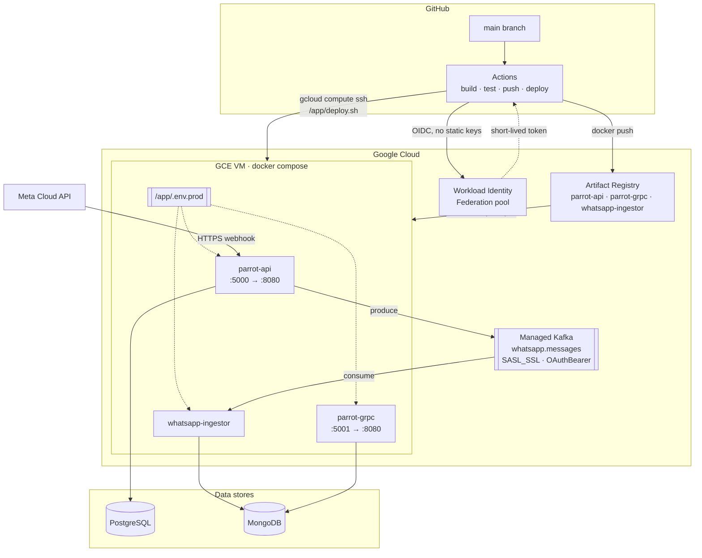
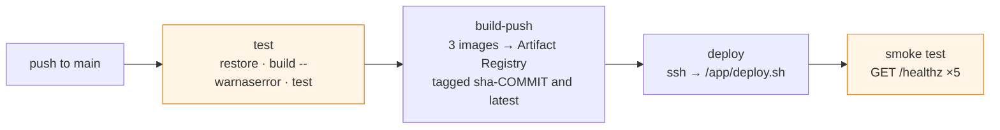

# Deployment and setup

How Parrot is built, shipped, and run in production, and how to stand the
whole thing up from an empty GCP project.

For the local development loop, see the [README](../README.md).

---

## Target topology

Three container images run on a single Compute Engine VM behind Docker
Compose. State lives outside the VM: Google Managed Service for Apache Kafka,
plus PostgreSQL and MongoDB instances you provision.



Authentication to GCP uses **Workload Identity Federation**: GitHub Actions
exchanges its OIDC token for short-lived Google credentials, so no service
account key is ever stored in the repository. The only long-lived secret is the
SSH key used to reach the VM.

---

## Release pipeline



Defined in [.github/workflows/deploy.yml](../.github/workflows/deploy.yml),
triggered on every push to `main`. A separate
[build.yml](../.github/workflows/build.yml) runs build, test with coverage, and
`dotnet format --verify-no-changes` on `main`, `develop`, and pull requests.

On the VM, `/app/deploy.sh` (installed by `setup-vm.sh`) does the actual
rollout:

```bash
docker compose -f docker-compose.prod.yml pull
docker compose -f docker-compose.prod.yml up -d --remove-orphans
docker system prune -f --volumes=false
```

> **The stages marked in amber cannot pass on the current tree.** The `test`
> stage runs a bare `dotnet restore` (fails with `MSB1011`, two solution files
> in the root) and the smoke test polls `/healthz`, which no service
> implements. See [Before your first deploy](#before-your-first-deploy).

---

## First-time setup

Four steps, in order. Steps 1–3 are one-time per environment.

### 1. Bootstrap GCP

Edit the configuration block at the top of
[infra/setup-gcp.sh](../infra/setup-gcp.sh) — `PROJECT_ID`, `REGION`,
`GITHUB_ORG`, `GITHUB_REPO`, `VM_NAME`, `VM_ZONE` — then run it from a machine
with Owner or Editor on the project:

```bash
./infra/setup-gcp.sh
```

It enables the required APIs, creates the Artifact Registry repository and the
`github-actions-deploy` service account, grants `artifactregistry.writer`,
`compute.osLogin` and `iam.serviceAccountUser`, creates the Workload Identity
pool and GitHub OIDC provider (scoped by an attribute condition to your
repository only), generates an SSH deploy key, and adds its public half to the
VM's instance metadata.

The script prints every value you need for GitHub. Note the VM must already
exist when you run it, since it writes SSH metadata to the instance.

### 2. Provision Managed Kafka

Edit and run [infra/kafka/setup.sh](../infra/kafka/setup.sh):

```bash
./infra/kafka/setup.sh
```

Creates a Managed Kafka cluster (3 vCPU / 3 GiB minimum) and the
`whatsapp.messages` topic with 3 partitions and replication factor 3, then
prints the bootstrap address. Keep that address — it goes into `.env.prod` as
`KAFKA__BOOTSTRAPSERVERS`.

Production Kafka uses `SASL_SSL` with OAuthBearer tokens from Application
Default Credentials. That path is enabled by `Kafka:UseGcpAuth=true`, which
[appsettings.Production.json](../Parrot.Api/appsettings.Production.json)
already sets — so the VM's service account needs Managed Kafka client
permissions.

### 3. Provision the VM

On a fresh Debian GCE instance, edit `REGION` / `PROJECT_ID` at the top of
[infra/vm/setup-vm.sh](../infra/vm/setup-vm.sh) and run it:

```bash
./infra/vm/setup-vm.sh
```

It installs Docker and the Compose plugin, configures Docker for Artifact
Registry, creates `/app`, writes `/app/deploy.sh`, and drops a
`/app/.env.prod` template.

Two things the script does **not** do, and you must:

```bash
# 1. Copy the production compose file into place
scp infra/docker-compose.prod.yml VM:/app/docker-compose.prod.yml

# 2. Fill in every REPLACE_ME in /app/.env.prod
```

Log out and back in after the script runs so the `docker` group membership
takes effect.

### 4. Configure GitHub

**Secrets** (Settings → Secrets and variables → Actions):

| Secret | Source |
|---|---|
| `WIF_PROVIDER` | printed by `setup-gcp.sh` |
| `WIF_SERVICE_ACCOUNT` | printed by `setup-gcp.sh` |
| `GCP_SSH_PRIVATE_KEY` | private half of the generated deploy key |

**Variables:**

| Variable | Example |
|---|---|
| `GCP_PROJECT_ID` | `parrot-prod` |
| `GCP_REGION` | `us-central1` |
| `GCP_AR_REPO` | `parrot` |
| `GCP_VM_NAME` | `parrot-vm` |
| `GCP_VM_ZONE` | `us-central1-a` |
| `GCP_APP_URL` | `https://api.example.com` — optional; enables the post-deploy smoke test |

The deploy job targets the `production` GitHub environment, so you can require
manual approval there.

---

## Production configuration

All three containers read the same `/app/.env.prod` via `env_file`. Keys use
the ASP.NET Core environment-variable form: `:` becomes `__`.

```bash
# Artifact Registry base path — must match GCP_REGION/GCP_PROJECT_ID/GCP_AR_REPO
AR_REGISTRY=us-central1-docker.pkg.dev/your-project/parrot

# Kafka (bootstrap address from infra/kafka/setup.sh)
KAFKA__BOOTSTRAPSERVERS=bootstrap.parrot-kafka.us-central1.managedkafka.your-project.cloud.goog:9092
KAFKA__TOPIC=whatsapp.messages
KAFKA__CONSUMERGROUPID=whatsapp-ingestor
KAFKA__USEGCPAUTH=true

# PostgreSQL
CONNECTIONSTRINGS__DEFAULTCONNECTION=Host=...;Port=5432;Database=parrot;Username=parrot;Password=...

# MongoDB
MONGODB__CONNECTIONSTRING=mongodb://...:27017
MONGODB__DATABASE=parrot
MONGODB__COLLECTION=whatsapp_messages

# JWT — must be at least 32 characters and must not be the placeholder
JWTSETTINGS__SECRET=...
JWTSETTINGS__ISSUER=ParrotApi
JWTSETTINGS__AUDIENCE=ParrotApp
JWTSETTINGS__EXPIRATIONINMINUTES=60

# Google OAuth — required, the API will not start without these
GOOGLEOAUTH__CLIENTID=...
GOOGLEOAUTH__CLIENTSECRET=...

# Meta channels
WHATSAPP__VERIFYTOKEN=...
WHATSAPP__APPSECRET=...
WHATSAPP__ACCESSTOKEN=...
WHATSAPP__PHONENUMBERID=...
WHATSAPP__BUSINESSACCOUNTID=...
WHATSAPP__WEBHOOKBASEURL=https://api.example.com
FACEBOOK__APPSECRET=...
FACEBOOK__VERIFYTOKEN=...

# Outbound email
EMAILSETTINGS__SMTPHOST=...
EMAILSETTINGS__SMTPPORT=587
EMAILSETTINGS__SMTPUSER=...
EMAILSETTINGS__SMTPPASSWORD=...
EMAILSETTINGS__FROMADDRESS=no-reply@example.com
FRONTENDSETTINGS__BASEURL=https://app.example.com

# Model and enrichment providers
ANTHROPIC__APIKEY=...
BRIGHTDATA__APIKEY=...
BRIGHTDATA__ZONE=...
```

Two guardrails fire at startup outside Development: the API and the gRPC
service both throw if `JwtSettings:Secret` is still the shipped placeholder,
and the API throws if `GoogleOAuth:ClientId` or `ClientSecret` is missing.

The template written by `setup-vm.sh` uses `KAFKA__CONSUMERGROUP`, which binds
to nothing — the property is `ConsumerGroupId`. Use `KAFKA__CONSUMERGROUPID`
as shown above.

### Ports

| Container | Host port | Container port |
|---|---|---|
| `parrot-api` | 5000 | 8080 |
| `parrot-grpc` | 5001 | 8080 |
| `whatsapp-ingestor` | — | — |

Both HTTP services listen on plain `:8080` inside the container. Terminate TLS
in front of them — a reverse proxy or load balancer — since Meta only delivers
webhooks over HTTPS. Note that gRPC needs end-to-end HTTP/2, so the proxy in
front of `parrot-grpc` must support it.

All three log to `journald` with a per-service tag:

```bash
journalctl -t parrot-api -f
journalctl -t whatsapp-ingestor -f
```

---

## Database migrations

Nothing in the pipeline applies migrations — no service calls `Migrate()` at
startup and no CI step runs `dotnet ef`. Applying them is a manual step, and it
must happen **before** the image that depends on them starts serving.

```bash
dotnet ef database update \
  --project Parrot.Infrastructure \
  --startup-project Parrot.Api \
  --connection "Host=...;Port=5432;Database=parrot;Username=parrot;Password=..."
```

Or generate SQL for review and apply it through your normal database change
process:

```bash
dotnet ef migrations script --idempotent \
  --project Parrot.Infrastructure \
  --startup-project Parrot.Api \
  --output migrate.sql
```

A missing migration is silent until a request touches the absent table, so
check `__EFMigrationsHistory` against the `Migrations/` directory after every
release that adds one.

---

## Before your first deploy

The pipeline has three defects that will stop a green deploy. Fix them, or
know exactly what you are working around.

**1. `deploy.yml` cannot restore.** Its `test` job runs a bare
`dotnet restore`, which fails with `MSB1011` because the root holds both
`Backend.slnx` and `Parrot.Api.slnx`. Pin the solution the way `build.yml`
already does:

```yaml
- run: dotnet restore Backend.slnx
- run: dotnet build Backend.slnx --configuration Release --no-restore --warnaserror
- run: dotnet test  Backend.slnx --configuration Release --no-build --verbosity normal
```

Note that `--warnaserror` promotes the StyleCop analyzer warnings the tree
currently emits; expect to either clear them or scope the flag.

**2. No service implements `/healthz`.** The Compose healthchecks
(`curl -f http://localhost:8080/healthz`) and the post-deploy smoke test both
depend on it, so containers will be marked unhealthy and the deploy job will
fail after five attempts. Add the endpoint to both hosts:

```csharp
builder.Services.AddHealthChecks();
// ...
app.MapHealthChecks("/healthz");
```

Also note the healthcheck shells out to `curl`, which is **not present in the
`mcr.microsoft.com/dotnet/aspnet:10.0` base image**. Either install it in the
Dockerfile or switch the check to a `dotnet`-based probe.

**3. The ingestor stops permanently on its first Kafka error.** In
[Worker.cs:139-142](../WhatsAppMessageIngestor/Worker.cs#L139-L142) the
`catch (ConsumeException)` is outside the consume loop, so a single transient
broker error — including "topic does not exist yet" during a cold start — ends
ingestion while the container keeps running and `restart: unless-stopped` never
fires. Move the catch inside the loop with a backoff, or add a liveness signal
that fails when the worker stops consuming.

Until this is fixed, the topic must exist before the ingestor starts, and a
broker blip requires a manual `docker compose restart whatsapp-ingestor`.

**Also worth knowing:** `Parrot.Web` is not part of the deploy at all. It has no
Dockerfile and no pipeline stage — only the API, gRPC service, and ingestor
ship. Deploy the dashboard separately, or add an image and a stage for it.

---

## Deploying

Once setup is complete, a deploy is a push:

```bash
git push origin main
```

Follow it in the Actions tab. Images are tagged `sha-<commit>` and `latest`.

### Manual deploy

```bash
gcloud compute ssh parrot-vm --zone us-central1-a \
  --command="IMAGE_TAG=sha-<commit> /app/deploy.sh"
```

### Rollback

Images are immutable and tagged by commit, so rolling back is redeploying an
earlier tag:

```bash
gcloud compute ssh parrot-vm --zone us-central1-a \
  --command="IMAGE_TAG=sha-<previous-commit> /app/deploy.sh"
```

`docker-compose.prod.yml` reads `${IMAGE_TAG:-latest}`, so pass `IMAGE_TAG`
explicitly on every rollback — otherwise `latest` pulls the build you are
trying to back out of. Roll the database back separately if the release
included a migration; nothing here does that for you.

---

## Post-deploy verification

```bash
# Containers up and healthy
gcloud compute ssh parrot-vm --zone us-central1-a --command="docker compose -f /app/docker-compose.prod.yml ps"

# API reachable through the proxy
curl -i https://api.example.com/api/webhooks/whatsapp?hub.mode=subscribe\&hub.verify_token=wrong\&hub.challenge=1   # expect 403

# Ingestor consuming
gcloud compute ssh parrot-vm --zone us-central1-a --command="journalctl -t whatsapp-ingestor -n 50"
```

A healthy ingestor logs `Kafka consumer subscribed` once at startup and then
stays quiet. Repeated `Kafka consume error` lines mean the worker has already
exited — see defect 3 above.

Confirm the Meta webhook subscription still points at the right origin: the
callback URL in the Meta App dashboard must match
`WHATSAPP__WEBHOOKBASEURL` + `/api/webhooks/whatsapp`, and the verify token
must match `WHATSAPP__VERIFYTOKEN`.
